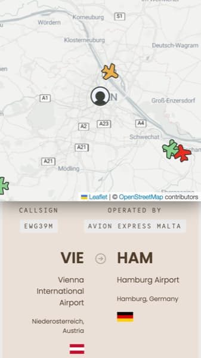
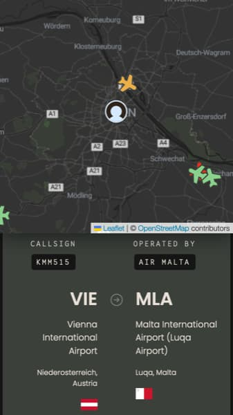

<div align="center">
  
  <br />
  <h1><a href="https://esfliegt.vercel.app">Es fliegt, es fliegt</a></h1>
  <strong>A website to display information about aircraft flying above you.</strong>
  <br />
  <br />
  <a href="https://github.com/saschazar21/esfliegt-esfliegt/actions/workflows/deploy.yml"></a> 
  <br />
  <br />
  <br />
  &nbsp;
  
  <br />
  <br />
  <br />
</div>

## What is it?

This repository contains the source code of a website for displaying aircraft in the current vicinity of 20km around a detected geo location.

> [!NOTE]
>
> This is the **Vercel** branch. To compare it against other deployment providers, visit the [Cloudflare Pages](/saschazar21/esfliegt-esfliegt/tree/cloudflare-pages) or [Netlify Edge](/saschazar21/esfliegt-esfliegt/tree/netlify-edge) branch.

## Getting started

### Prerequisites

The following prerequisites are needed to successfully launch this project locally:

#### Runtimes

- [Node.js v20+](https://nodejs.org/en/)

- [Yarn](https://yarnpkg.dev/) or similar

### Quick start

1. Copy `.env.sample` to `.env` and populate the environment variables

   ```bash
   cp .env.sample .env
   ```

2. Install dependencies

   ```bash
   yarn # or npm install
   ```

3. Run the build

   ```bash
   yarn build # or npm run build
   ```

4. Run the local server

   ```bash
   yarn start # or npm start
   ```

--- OR ---

5. Run development preview

   ```bash
   yarn dev # or npm run dev
   ```

## Deployment

> [!TIP]  
> Do not forget to set the `IMAGEKIT_ID` environment variable in the Vercel dashboard.

First, pull your production environment from Vercel:

```sh
pnpm vercel pull --yes --context=production
```

Then, build your app for production:

```sh
pnpm build
```

Finally, deploy your app to Cloudflare Pages:

```sh
pnpm vercel deploy --prod
```

## License

Licensed under the MIT license.

Copyright ©️ 2024 [Sascha Zarhuber](https://sascha.work)
